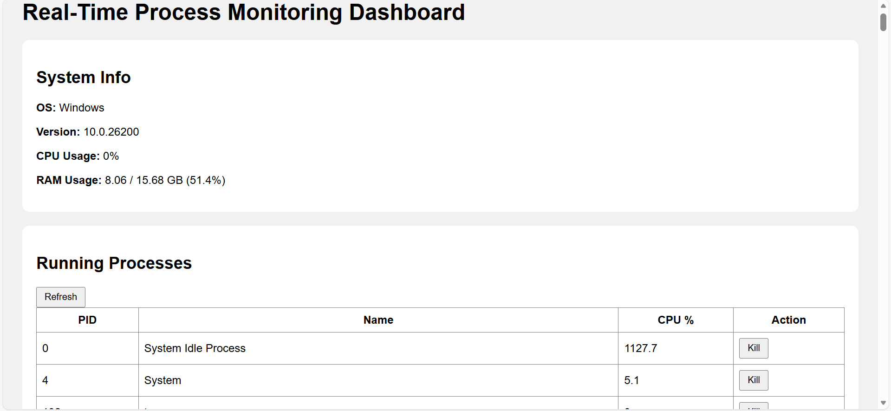
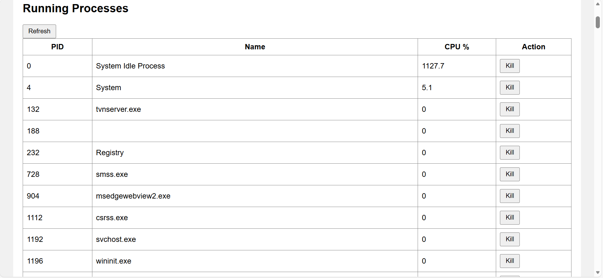

# RTM – Real-Time Process Monitoring Dashboard

A Real-Time Process Monitoring Dashboard built using Python and Flask that displays **live CPU usage, memory consumption, and currently running system processes**.  
The tool also allows administrators to **search processes, filter top CPU-consuming processes, and kill processes** directly from the dashboard.

This project is designed as part of the *Real-Time Process Monitoring* assignment (Problem Statement 13).

---

## 📌 Project Overview

RTM (Real-Time Monitoring Dashboard) is a web-based application that shows system performance in real-time with live updates.  
It helps users and administrators:

- Watch CPU & memory consumption  
- Monitor running processes  
- Identify high-CPU tasks  
- Kill unwanted processes  
- Refresh data instantly  

---

## 🎯 Features

### 🔹 **1. Real-Time CPU Monitoring**
- Displays live CPU percentage.
- Animated progress bar.
- Auto-refresh every 2 seconds.

### 🔹 **2. Real-Time Memory Monitoring**
- Shows memory in use (%)
- Shows used & total MB
- Auto-updates continuously

### 🔹 **3. Process Viewer**
- Displays list of all system processes:
  - PID  
  - Name  
  - User  
  - CPU usage  
  - Memory usage  
  - Status  
- Sorts automatically by CPU usage (highest first)

### 🔹 **4. Process Search**
- Search any process by name (e.g., chrome, python).

### 🔹 **5. Kill Process**
- Enter PID → Click **Kill**
- Safe (cannot kill server PID)
- Returns success or error message

### 🔹 **6. Works on Any Computer**
- Windows  
- Linux  
- Mac  
- Python 3.8+ compatible

---

## 🛠️ Technology Used

### **Programming Language**
- Python 3

### **Backend Framework**
- Flask

### **Libraries**
- psutil  
- flask  
- flask-cors  

### **Frontend**
- HTML5  
- CSS3  
- JavaScript (Vanilla)

### **Other Tools**
- GitHub (version control)
- Browser (Chrome recommended)

---

## 📁 Project Structure

RTM/
│── server.py
│── index.html
│── styles.css
│── script.js
│── requirements.txt
│── README.md

---

## 🚀 How to Run the Project

### **Step 1: Install Dependencies**

pip install -r requirements.txt

### **Step 2: Run the Server**

python server.py

### **Step 3: Open in Browser**

Visit:  http://127.0.0.1:5000/

The dashboard will load.

---

## 📸 Screenshots

